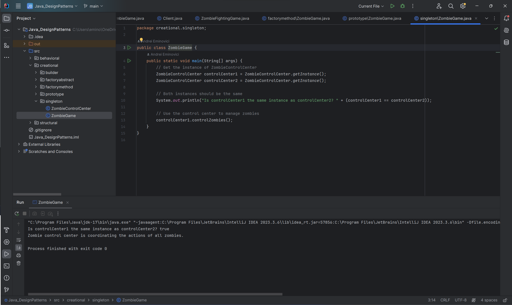

# Zombie Survival Design Patterns Showcase

Welcome to the Zombie Survival Design Patterns Showcase! In this project, we demonstrate various design patterns applied to a zombie-themed scenario to enhance the survivability of our survivors.

## Table of Contents

1. [Introduction](#introduction)
2. [Creational Patterns](#creational-patterns)
    - [Builder](#builder)
    - [Factory](#factory)
    - [Abstract Factory](#abstract-factory)
    - [Prototype](#prototype)
    - [Singleton](#singleton)
3. [Structural Patterns](#structural-patterns)
    - [Adapter](#adapter)
    - [Bridge](#bridge)
    - [Composite](#composite)
    - [Decorator](#decorator)
    - [Facade](#facade)
    - [Flyweight](#flyweight)
    - [Proxy](#proxy)
4. [Behavioral Patterns](#behavioral-patterns)
    - [Chain of Responsibility](#chain-of-responsibility)
    - [Command](#command)
    - [Interpreter](#interpreter)
    - [Iterator](#iterator)
    - [Mediator](#mediator)
    - [Memento](#memento)
    - [Observer](#observer)
    - [State](#state)
    - [Strategy](#strategy)
    - [Template](#template)
    - [Visitor](#visitor)
5. [Conclusion](#conclusion)

## Introduction

In this project, we simulate a zombie apocalypse scenario where survivors must use various strategies and tactics to survive. We utilize different design patterns to model survivor behaviors, interactions, and strategies against the zombie threat.

## Creational Patterns

### Builder

In this example, the Client class demonstrates the usage of the builder pattern by creating instances of Zombie and BestiaryEntry using the Director and appropriate builder classes. Each object is constructed with specific attributes defined by the Director, allowing for easy creation of complex objects without exposing their internal construction process.

### Factory

In this example, the ZombieFactory class serves as the factory, and the createZombie method creates instances of different types of zombies based on the given parameters. This way, the creation logic is encapsulated within the factory, making it easy to add new types of zombies without modifying the client code.

### Abstract Factory

In this example, the abstract factory pattern is used to create families of related objects, such as melee weapons and ranged weapons. The WeaponFactory interface defines methods for creating different types of weapons, and concrete factory classes (BeginnerWeaponFactory and AdvancedWeaponFactory) implement these methods to create specific instances of weapons suitable for different player levels. This approach allows us to easily switch between different sets of related objects (weapons) without changing the client code.

### Prototype

In this example, the Zombie interface declares the clone method for creating new instances of zombies by cloning existing ones. NormalZombie and FastZombie are concrete implementations of the Zombie interface, each providing their own implementation of the clone method.
In the main method, we create initial zombie prototypes (normalZombiePrototype and fastZombiePrototype), and then create new instances of zombies (zombie1 and zombie2) by cloning these prototypes. Finally, we demonstrate that the cloned zombies can perform their own attacks.

### Singleton

In this example, the ZombieControlCenter class represents the singleton. It has a private constructor to prevent external instantiation and a static method getInstance() to provide the single instance of the class. The controlZombies() method represents the functionality of the control center.
In the main method, we demonstrate that no matter how many times we call getInstance(), we always get the same instance of ZombieControlCenter. This ensures that there's only one central control center for coordinating the actions of all zombies throughout the game.

## Structural Patterns

### Adapter

In this example, we've created a subclass of Zombie called GunZombie, which has an additional method shoot() to represent shooting a weapon.
The ZombieAdapter class takes a GunZombie instance..
In the main method, we create a GunZombie instance and then create a ZombieAdapter instance, passing the GunZombie instance to its constructor. Finally, we use the Weapon interface to call the use() method, which internally calls the shoot() method of the GunZombie class through the adapter, allowing the GunZombie to use its additional ability through the adapter pattern.

### Bridge

In this example, the ZombieType interface represents the implementor, defining a method attack() for zombie behavior. Concrete implementations, such as NormalZombie and FastZombie, represent different types of zombies with their unique attack methods.
The Zombie class acts as the abstraction, which contains a reference to the implementor (ZombieType). It provides a method performAttack() which delegates the attack behavior to the implementor.
Finally, we have two refined abstractions, RegularZombie and SpecialZombie, which represent different types of zombies that extend the Zombie abstraction and specify the type of zombie behavior they possess.
In the client code, we create instances of different types of zombies and call the performAttack() method, which internally calls the appropriate attack method based on the zombie's type. This demonstrates how the Bridge pattern decouples abstraction from implementation, allowing them to vary independently.

### Composite

In this example, the Zombie interface represents the component of the composite pattern, defining the attack() method.
The BasicZombie class represents the leaf nodes of the composite structure, which are individual zombies with no further structure.
The ZombieGroup class represents the composite nodes of the composite structure, which are groups of zombies. It contains a list of Zombie objects and can add or remove zombies from the group. The attack() method of ZombieGroup iterates over its zombies, delegating the attack to each individual zombie in the group.
In the client code, we create instances of BasicZombie and ZombieGroup and add them together to form a hierarchical structure. We then call the attack() method on the groups, which recursively calls the attack() method of each zombie within the group, demonstrating the composite pattern's ability to treat individual objects and compositions of objects uniformly.

### Decorator

In this example, the Zombie interface represents the component of the decorator pattern, defining the attack() method.
The BasicZombie class is the concrete component, representing the base type of zombie.
The ZombieDecorator abstract class implements the Zombie interface and maintains a reference to a Zombie object, allowing it to forward behavior to the decorated object.
The GunDecorator and ArmorDecorator classes are concrete decorators, each adding additional behavior to the decorated zombie.
In the client code, we create a BasicZombie instance and then decorate it with GunDecorator and ArmorDecorator. We then call the attack() method on each decorated zombie, which in turn delegates to the base zombie's attack() method and adds the additional behavior specified by the decorators. This demonstrates how the Decorator pattern can dynamically extend the behavior of individual objects at runtime.

### Facade

In this example, ZombieHorde and ZombieSpawner represent the complex subsystems that deal with summoning, attacking, retreating, spawning, and despawning zombies.
ZombieFacade provides a simplified interface to these subsystems. It hides the complexity of managing zombie encounters behind a single interface.
The startEncounter() method of ZombieFacade orchestrates the summoning of a zombie horde and spawning of zombies.
The endEncounter() method of ZombieFacade orchestrates the retreat of the zombie horde and despawning of zombies.
In the client code, we create a ZombieFacade instance and use it to start and end a zombie encounter. The client doesn't need to know about the individual steps involved in managing the encounter; it simply uses the facade to perform the necessary actions, making the code easier to understand and maintain.

### Flyweight

In this example, Zombie is the flyweight interface that declares the method attack().
BasicZombie is the concrete flyweight class that implements the Zombie interface. It contains intrinsic properties like the zombie type.
ZombieFactory is the flyweight factory class that manages a pool of flyweight objects (zombies) and provides a method getZombie() to retrieve a flyweight object based on the intrinsic properties.
In the client code, we create instances of different types of zombies using the ZombieFactory. If a zombie of a particular type already exists in the factory, it's reused instead of creating a new one. This demonstrates how the Flyweight pattern conserves memory by sharing common state among multiple objects.

### Proxy

In this example, Zombie is the subject interface that declares the method attack().
RealZombie is the real subject class that implements the Zombie interface. It represents the actual zombie object.
ZombieProxy is the proxy class that also implements the Zombie interface. It delays the creation of the RealZombie object until the attack() method is called. It forwards the attack() call to the real zombie object once it's created.
In the client code, we create a ZombieProxy instance and call the attack() method on it. The first time attack() is called, the RealZombie object is created. Subsequent calls to attack() reuse the existing RealZombie object. This demonstrates how the Proxy pattern can defer the creation and initialization of the real object until it's actually needed.

## Behavioral Patterns

### Chain of Responsibility

In this example, ZombieDefenseHandler is the handler interface that declares methods for handling zombie attacks and setting the next handler in the chain.
BarricadeDefenseHandler, TrapDefenseHandler, and WeaponDefenseHandler are concrete handlers that implement the ZombieDefenseHandler interface. Each handler decides whether to handle the attack or pass it to the next handler in the chain based on its capability.
In the client code, we create the chain of responsibility by linking the handlers together. When a zombie attack occurs, we call the handleAttack() method on the first handler in the chain, which then delegates the request to the next handler if necessary. This continues until the attack is handled or the end of the chain is reached.

### Command

In this example, Zombie acts as the receiver, which contains methods for attacking, retreating, and barricading.
ZombieCommand is the command interface that declares the execute() method.
AttackCommand, RetreatCommand, and BarricadeCommand are concrete command classes that implement the ZombieCommand interface. Each command encapsulates a specific action to be performed on the zombie.
Commander acts as the invoker, which sets and executes commands.
In the client code, we create instances of zombies and commands. We then set commands to the Commander and execute them, which in turn calls the appropriate method on the zombie, demonstrating how the Command pattern decouples the sender of a request from the receiver.

### Interpreter

In this example, ZombieContext represents the context in which the expressions are interpreted. It contains information about the number of zombies.
ZombieExpression is the abstract expression interface that declares the interpret() method.
AttackExpression and RetreatExpression are terminal expressions that interpret commands to attack and retreat zombies, respectively.
CompositeExpression is a non-terminal expression that composes multiple expressions into a single expression.
In the client code, we create instances of AttackExpression and RetreatExpression, then combine them into a CompositeExpression representing a sequence of commands. We interpret this composite expression within the context of a ZombieContext, demonstrating how the Interpreter pattern can be used to interpret commands in a zombie-themed scenario.

### Iterator

In this example, ZombieCollection is the aggregate interface that declares the method createIterator() to create an iterator for iterating over zombies.
ZombieHorde is the concrete aggregate that contains a collection of zombies and provides an implementation for creating iterators over its zombies.
ZombieIterator is the iterator interface that extends java.util.Iterator<Zombie> to provide standard iterator functionality.
ConcreteZombieIterator is the concrete iterator that implements the ZombieIterator interface. It keeps track of the current position while iterating over zombies in the horde.
In the client code, we create a ZombieHorde and add some zombies to it. We then create an iterator using createIterator() and use it to iterate over the zombies in the horde, printing each zombie's name as it's encountered.
This demonstrates how the Iterator pattern can be used to iterate over a collection of zombies in a zombie-themed scenario without exposing the underlying implementation details of the collection.

### Mediator

In this example, the ZombieMediator interface declares methods for notifying survivors, barricades, and weapons about events.
The ZombieGameMediator class is the concrete mediator that maintains lists of survivors, barricades, and weapons and mediates their interactions.
The Survivor, Barricade, and Weapon classes are concrete colleagues that can send messages to each other via the mediator.
In the client code, we create instances of survivors, barricades, and weapons, register them with the mediator, and simulate events (e.g., barricade being destroyed, weapon being broken) to see how messages are propagated through the mediator to the other entities.

### Memento

In this example, ZombieMemento represents the memento object that stores the state of the zombie, including health and position.
Zombie is the originator that creates mementos and restores its state from mementos.
ZombieCaretaker is the caretaker that saves and retrieves mementos.
In the client code, we create a Zombie object and save its initial state using the caretaker. Then, we simulate changes to the zombie's state (damage and movement) before restoring its original state from the saved memento. This demonstrates how the Memento pattern can be used to save and restore the state of objects in a zombie-themed scenario.

### Observer

In this example, ZombieObservable is the subject interface that declares methods for adding, removing, and notifying observers.
ZombieTracker is the concrete subject that maintains a list of observers and notifies them when a zombie is sighted.
SurvivorObserver is the observer interface that declares the update() method to be called when notified about a zombie sighting.
Survivor is the concrete observer representing a survivor. When notified about a zombie sighting, it takes evasive action.
In the client code, we create a ZombieTracker object and add multiple Survivor objects as observers. When a zombie is sighted, the tracker notifies all observers about the sighting, and each survivor takes evasive action accordingly.

### State

In this example, SurvivorContext represents the context in which the survivor exists and maintains the current state.
SurvivorState is the state interface that declares the performAction() method to be implemented by concrete states.
NormalState, AlertState, and PanicState are concrete states representing different states a survivor can be in, each implementing the performAction() method accordingly.
In the client code, we create a SurvivorContext object representing a survivor and perform actions based on the survivor's state. Initially, the survivor is in the "Normal" state and performs actions appropriate for that state. We then change the state to "Alert" and "Panic" and observe the different behaviors associated with each state.

### Strategy

In this example, AttackStrategy is the strategy interface that declares the attack() method to be implemented by concrete strategies.
MeleeAttackStrategy and RangedAttackStrategy are concrete strategies representing different attack strategies survivors can use against zombies.
Survivor is the context class that holds a reference to the current attack strategy and delegates the attack behavior to the chosen strategy.
In the client code, we create a Survivor object and set different attack strategies (MeleeAttackStrategy and RangedAttackStrategy) based on the survivor's choice. We then perform attacks using the selected strategy, which demonstrates the flexibility of the Strategy pattern in allowing survivors to switch between different attack strategies dynamically.

### Template

In this example, ZombieSurvivalGuide is the abstract class that defines the template method surviveZombieApocalypse(), which contains a series of steps to survive a zombie apocalypse. These steps are implemented as abstract methods that can be customized by subclasses.
HouseSurvivalGuide and WarehouseSurvivalGuide are concrete subclasses that provide specific implementations for the steps of surviving a zombie apocalypse based on whether the survivor is in a house or a warehouse.
In the client code, we create instances of HouseSurvivalGuide and WarehouseSurvivalGuide and call the surviveZombieApocalypse() method to demonstrate the template method in action for different scenarios.

### Visitor

In this example, SurvivorVisitor is the visitor interface that declares visit methods for each type of zombie.
Survivor is a concrete visitor that implements the SurvivorVisitor interface and defines specific actions survivors can take when encountering different types of zombies.
Zombie is the element interface that declares the accept method to accept visitors.
BasicZombie, FastZombie, and ArmoredZombie are concrete elements representing different types of zombies. Each implements the Zombie interface and accepts visitors.
In the client code, we create an instance of the Survivor class and an array of different types of zombies. We then loop through the zombies and let the survivor visit each zombie, performing appropriate actions based on the type of zombie encountered. This demonstrates how the Visitor pattern allows us to separate the algorithm for performing actions from the elements on which it operates, promoting better extensibility and maintainability.

## Conclusion

In this project, we've explored a wide range of design patterns applied to a zombie-themed scenario. These patterns have allowed us to model various survivor behaviors, interactions, and strategies effectively, enhancing the overall maintainability of a real codebase in case of a video game project.

Feel free to clone this project and explore the code to gain a deeper understanding of how each design pattern is implemented and utilized in a real-world scenario.
